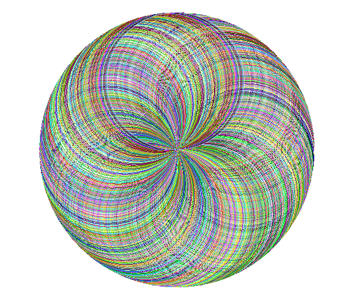
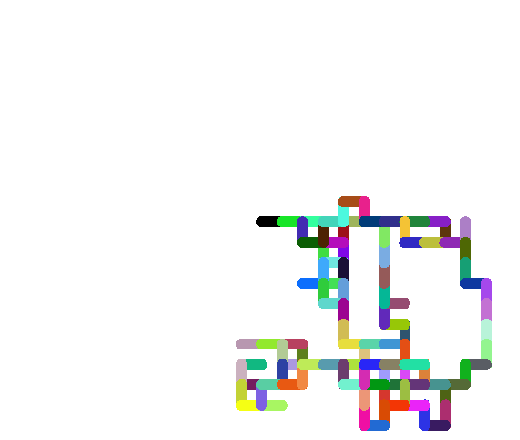
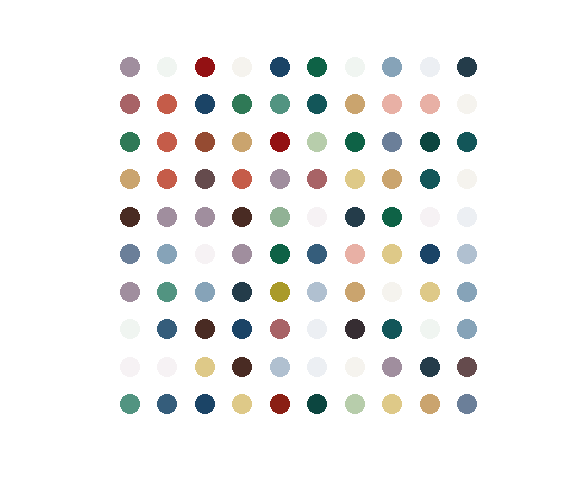

# 🎨 Abstract-Art

A collection of Python scripts that generate beautiful abstract art using the `turtle` graphics library. Each script produces a unique style of artwork and saves it as a PNG image.

---

## 🖼️ Gallery

| Spirograph | Random Walk | Hirst Dotted Art |
|:-----------:|:-----------:|:----------------:|
|  |  |  |

> 💡 *Add your own generated images to the paths above to populate the gallery!*

---

## 📁 Project Structure

```
Abstract-Art/
├── spirograph/
│   ├── spirograph.py
│   └── generated_images/
├── random-walk/
│   ├── random_walk.py
│   └── generated_Images/
└── hirst-dotted-art/
    ├── hirst_dotted_art.py
    ├── reference_image.jpg
    └── generated_Images/
```

---

## 🚀 Getting Started

### Prerequisites

Make sure you have Python 3 installed, then install the required dependencies:

```bash
pip install pillow colorgram.py
```

> `turtle` is part of Python's standard library — no installation needed.

---

## 🌀 Scripts

### 1. Spirograph

Draws a colorful spirograph by layering overlapping circles, each rotated by a small increment and filled with a random color.

**Run:**
```bash
python spirograph/spirograph.py
```

**Customize (edit the constants at the top of the file):**

| Constant | Default | Description |
|----------|---------|-------------|
| `RADIUS` | `150` | Radius of each circle |
| `INCREMENT` | `1` | Rotation between each circle (degrees) |
| `PENSIZE` | `15` | Thickness of the drawn lines |
| `SAVE_PATH` | `spirograph/generated_images/spirograph.png` | Output image path |

> 🔧 Smaller `INCREMENT` = more circles = denser, more detailed spirograph.

---

### 2. Random Walk

Simulates a random walk — the turtle moves forward a fixed distance, then turns in a random direction, painting a colorful trail.

**Run:**
```bash
python random-walk/random_walk.py
```

**Customize:**

| Constant | Default | Description |
|----------|---------|-------------|
| `WALKS` | `200` | Number of steps the turtle takes |
| `DISTANCE` | `30` | Distance per step |
| `PENSIZE` | `15` | Thickness of the drawn lines |
| `SAVE_PATH` | `random-walk/generated_Images/randomwalk.png` | Output image path |

> 🔧 Increase `WALKS` and `DISTANCE` for more dramatic, sprawling walks.

---

### 3. Hirst Dotted Art

Inspired by Damien Hirst's spot paintings. Extracts colors from a reference image and uses them to paint a grid of colorful dots.

**Run:**
```bash
python hirst-dotted-art/hirst_dotted_art.py
```

**Customize:**

| Constant | Default | Description |
|----------|---------|-------------|
| `LINES` | `10` | Number of rows of dots |
| `DOTS` | `10` | Number of dots per row |
| `RADIUS` | `25` | Size of each dot |
| `DISTANCE` | `50` | Spacing between dots |
| `COLOR_EXTRACTION_PATH` | `hirst-dotted-art/reference_image.jpg` | Source image for color palette |
| `SAVE_PATH` | `hirst-dotted-art/generated_Images/hirst-dotted-art.png` | Output image path |

> 🔧 Swap in any image as your `COLOR_EXTRACTION_PATH` for a completely different color palette!

---

## 💾 How Images Are Saved

Each script uses the following pipeline to save the artwork:

1. The turtle canvas is exported as a `.eps` (PostScript) file
2. PIL/Pillow converts the `.eps` to a `.png`
3. The temporary `.eps` file is automatically deleted

Make sure the `generated_images` / `generated_Images` folders exist before running, or the save will fail.

---

## 🛠️ Built With

- [Python](https://www.python.org/) — Core language
- [Turtle](https://docs.python.org/3/library/turtle.html) — Drawing & graphics
- [Pillow](https://python-pillow.org/) — Image conversion & saving
- [colorgram.py](https://github.com/obskyr/colorgram.py) — Color extraction from images (Hirst script only)

---

## 📄 License

THIS PROJECT IS COPYRIGHT PROTECTED(Im kidding use it as you like)